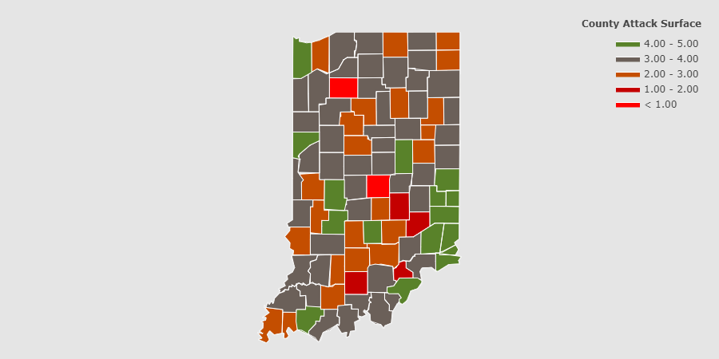

# Scan-of-Indiana

This map was created by gathering all the ip address located in Indiana and then preoceding to scan them with a vunerability scanner. In total I scanned over 700K IP address. I measured each county based on a few different criteria, # of open ports, # of vunerabilites, and # of free open information.

## Why create this
I created this to show and present to my states office of technology to help them out with their county by county trip across my state.
